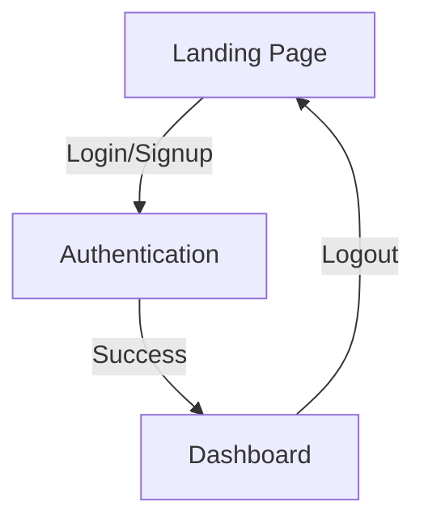

# SyncPulse Landing Page & Navigation System - Implementation Plan
## SPARC-GOAP Framework

**Project Version:** 1.0.0  
**Current Date:** May 15, 2026  
**Plan Created:** May 15, 2026  
**Estimated Timeline:** 2-3 weeks (iterative milestones)

---

## EXECUTIVE SUMMARY

This document defines a systematic, measurable implementation plan for creating a comprehensive landing page and navigation system for SyncPulse with an integrated subscription sales flow. The plan follows SPARC-GOAP (Specification-Pseudocode-Architecture-Refinement-Completion + Goal-Oriented Action Planning) methodology to ensure clear milestone definitions, parallel development opportunities, and measurable success criteria.

**Goal State:**
- Complete landing page replacing current dashboard entry point
- Site-wide navigation for authenticated and unauthenticated users
- Integrated subscription sales flow (Free/Pro/Enterprise tiers)
- Protected `/dashboard` route for authenticated users
- Seamless authentication integration with existing magic-link and password auth
- UX journey documentation using skill-based tooling
- Swarm visualization of project architecture

---

## PHASE 1: SPECIFICATION & PSEUDOCODE

### 1.1 Current State Analysis

**Authentication Infrastructure (READY):**
- Magic-link authentication service
- Password-based authentication
- Session management
- Express middleware for first-login enforcement

**Web Frontend (PARTIAL):**
- Next.js 14 app router
- Current dashboard at `/app/page.tsx` (serves as home page)
- No authentication guards
- No navigation component
- No subscription/pricing UI

**Existing Components:**
- SwarmVisualizer, RoadmapEditor, TaskMonitor, ControlPanel, TerminalLivestream
- Dark theme with Tailwind CSS
- Framer Motion for animations
- Zustand for state management

**Missing Pieces:**
- Navigation.tsx (site-wide)
- LandingPage component
- PricingPlans component
- FeatureGrid component
- Protected /dashboard route
- Auth middleware integration (client-side)
- Session verification hooks
- Subscription enrollment UI

### 1.2 Goal State Definition

**Success Criteria:**
1. **Navigation System:**
   - Sticky header with responsive design
   - Logo and branding
   - Auth state-aware buttons (Login/Signup vs. Profile/Logout)
   - Links to features, pricing, documentation
   - Mobile hamburger menu

2. **Landing Page:**
   - Hero section with SyncPulse value proposition
   - Feature showcase grid
   - Pricing tier cards with CTA buttons
   - FAQ section
   - Social proof section
   - Newsletter signup

3. **Authentication Flow:**
   - Unauthenticated users directed to landing page
   - Magic-link and password login options
   - Session verification on page load
   - Persistent session tokens (localStorage)

4. **Dashboard Protection:**
   - `/dashboard` route requires authentication
   - Redirect unauthenticated users to `/login`
   - Dashboard displays existing swarm visualizer, task monitor, etc.

5. **Subscription Integration:**
   - Three pricing tiers visible on landing
   - "Choose Plan" CTAs lead to signup flow
   - Selected plan stored in session/user context
   - Stripe/payment integration ready (hooks in place)

6. **Documentation:**
   - UX journey map using UX Journeymapper skill
   - Architecture diagram using Mermaid Terminal skill
   - Component hierarchy documented
   - API flow documentation

---

## PHASE 2: ARCHITECTURE & DESIGN

### 2.1 File Structure & Organization

```
packages/web/
├── app/
│   ├── layout.tsx (ROOT LAYOUT - add Navigation wrapper)
│   ├── page.tsx (LANDING PAGE - replace current dashboard)
│   ├── api/
│   │   ├── auth/
│   │   │   ├── login/route.ts
│   │   │   ├── signup/route.ts
│   │   │   ├── logout/route.ts
│   │   │   ├── verify-session/route.ts
│   │   │   └── magic-link/route.ts
│   │   ├── health/
│   │   ├── swarms/
│   │   └── ... (existing routes)
│   ├── (auth)/
│   │   ├── login/
│   │   │   └── page.tsx
│   │   ├── signup/
│   │   │   └── page.tsx
│   │   └── magic-link/
│   │       └── page.tsx
│   ├── dashboard/
│   │   └── page.tsx (PROTECTED - current dashboard content)
│   └── (public)/
│       ├── features/
│       │   └── page.tsx
│       ├── pricing/
│       │   └── page.tsx
│       └── about/
│           └── page.tsx
├── components/
│   ├── Navigation.tsx (STICKY HEADER)
│   ├── LandingPage/
│   │   ├── Hero.tsx
│   │   ├── Features.tsx
│   │   ├── PricingPlans.tsx
│   │   ├── FAQ.tsx
│   │   ├── SocialProof.tsx
│   │   └── Newsletter.tsx
│   ├── auth/
│   │   ├── LoginForm.tsx
│   │   ├── SignupForm.tsx
│   │   ├── MagicLinkForm.tsx
│   │   └── OAuthButtons.tsx
│   ├── Dashboard/ (existing)
│   │   └── SwarmVisualizer.tsx
│   │   └── ... (move to dashboard/page.tsx layout)
│   └── ... (existing)
├── hooks/
│   ├── useAuth.ts (session verification, login/logout)
│   ├── useSession.ts (session state management)
│   ├── useSubscription.ts (plan selection, status)
│   └── useProtectedRoute.ts (route guards)
├── lib/
│   ├── auth.ts (session management utilities)
│   ├── api-client.ts (API request wrapper with auth headers)
│   └── constants.ts (pricing tiers, feature list)
├── store/
│   ├── authStore.ts (Zustand auth state)
│   ├── subscriptionStore.ts (plan selection, user tier)
│   └── ... (existing)
├── middleware.ts (UPDATED - auth checks)
└── globals.css (UPDATED - ensure dark theme consistency)
```

### 2.2 Data Flow Architecture

```
USER JOURNEY:
1. Unauthenticated user visits syncpulse.io
   ↓
2. Root layout checks session via useAuth hook
   ↓
3. If no session: render Navigation (auth buttons) + Landing page
   ↓
4. User clicks "Get Started" → /signup
   ↓
5. Signup form → POST /api/auth/signup
   ↓
6. Session created, stored in localStorage + context
   ↓
7. Redirect to /dashboard
   ↓
8. Dashboard page checks auth via middleware
   ↓
9. Render Dashboard with swarm visualizer

AUTHENTICATED USER JOURNEY:
1. Returning user visits syncpulse.io
   ↓
2. useAuth hook loads session from localStorage
   ↓
3. Verifies session via /api/auth/verify-session
   ↓
4. Root layout renders Navigation with Profile menu
   ↓
5. Optionally redirects to /dashboard if accessing /
```

### 2.3 Component Hierarchy

```
RootLayout
├── Navigation (GLOBAL)
│   ├── Logo/Branding
│   ├── NavLinks (public/private)
│   └── AuthButtons OR UserMenu
│       ├── Profile dropdown
│       ├── Settings link
│       └── Logout button
│
├── Routes (page.tsx variants):
│   │
│   ├── / (Landing Page)
│   │   ├── Hero section
│   │   ├── Features grid
│   │   ├── Pricing section
│   │   │   └── PricingPlan cards (Free/Pro/Enterprise)
│   │   ├── FAQ accordion
│   │   ├── Social proof
│   │   └── CTA sections
│   │
│   ├── /dashboard (Protected)
│   │   ├── Dashboard header
│   │   ├── SwarmVisualizer
│   │   ├── TaskMonitor
│   │   ├── ControlPanel
│   │   ├── RoadmapEditor
│   │   └── TerminalLivestream
│   │
│   ├── /login (Public)
│   │   ├── LoginForm
│   │   ├── Magic link toggle
│   │   └── Signup link
│   │
│   └── /signup (Public)
│       └── SignupForm
```

### 2.4 Authentication State Management

```typescript
// authStore.ts (Zustand)
interface AuthState {
  user: User | null;
  isAuthenticated: boolean;
  isLoading: boolean;
  error: string | null;
  
  // Actions
  login(email, password): Promise<void>;
  loginWithMagicLink(email): Promise<void>;
  logout(): void;
  verifySession(): Promise<void>;
  updateUser(user): void;
  clearError(): void;
}

// useAuth.ts hook wraps store + effects
export function useAuth() {
  const auth = useAuthStore();
  
  useEffect(() => {
    // On mount, verify session exists
    auth.verifySession();
  }, []);
  
  return {
    user: auth.user,
    isAuthenticated: auth.isAuthenticated,
    isLoading: auth.isLoading,
    login: auth.login,
    logout: auth.logout,
    // ...
  };
}
```

### 2.5 Subscription/Pricing State

```typescript
// subscriptionStore.ts (Zustand)
export enum PricingTier {
  FREE = 'free',
  PRO = 'pro',
  ENTERPRISE = 'enterprise',
}

interface PricingPlan {
  id: PricingTier;
  name: string;
  price: number; // monthly
  features: string[];
  limits: Record<string, number>;
  cta: string;
}

interface SubscriptionState {
  selectedPlan: PricingTier | null;
  userTier: PricingTier;
  plans: PricingPlan[];
  
  selectPlan(tier: PricingTier): void;
  confirmPlan(): Promise<void>;
}
```

---

## PHASE 3: IMPLEMENTATION ROADMAP

### MILESTONE 1: Authentication Infrastructure (Days 1-3)
**Goal:** Establish client-side auth system and API routes

#### M1.1: Auth API Routes
**Deliverables:**
- `/api/auth/login` - POST endpoint
- `/api/auth/signup` - POST endpoint
- `/api/auth/logout` - POST endpoint
- `/api/auth/verify-session` - GET endpoint
- `/api/auth/magic-link` - POST endpoint

**Success Criteria:**
- All routes return proper JWT/session token
- Session tokens persist in secure HTTP-only cookies
- `verify-session` returns current user or 401
- Error responses follow standard format

**Technical Details:**
```typescript
// POST /api/auth/login
Request: { email: string, password: string }
Response: { token: string, user: User, expiresIn: number }

// GET /api/auth/verify-session
Response: { user: User } OR { error: string, status: 401 }

// POST /api/auth/logout
Response: { success: true }
```

**Parallelizable:** Yes - can occur independently

---

#### M1.2: Auth Store & Hooks
**Deliverables:**
- `store/authStore.ts` - Zustand auth state
- `hooks/useAuth.ts` - Auth hook with session verification
- `hooks/useProtectedRoute.ts` - Route protection hook
- `lib/auth.ts` - Auth utilities

**Success Criteria:**
- `useAuth()` loads session on mount via `/api/auth/verify-session`
- `useProtectedRoute()` redirects to `/login` if unauthenticated
- Auth state persists across page refreshes
- Error states properly handled

**Code Example:**
```typescript
// hooks/useAuth.ts
export function useAuth() {
  const auth = useAuthStore();
  const [isVerifying, setIsVerifying] = useState(true);

  useEffect(() => {
    auth.verifySession().finally(() => setIsVerifying(false));
  }, []);

  return { ...auth, isVerifying };
}

// Usage in component
const { user, isAuthenticated, isVerifying } = useAuth();
if (isVerifying) return <Spinner />;
if (!isAuthenticated) return <Navigate to="/login" />;
```

**Parallelizable:** After M1.1 API routes

---

### MILESTONE 2: Navigation & Layout System (Days 2-4)
**Goal:** Create site-wide navigation and restructure root layout

#### M2.1: Navigation Component
**Deliverables:**
- `components/Navigation.tsx` - Sticky header
- `components/Navigation/NavLinks.tsx` - Nav link items
- `components/Navigation/AuthMenu.tsx` - User dropdown
- Navigation styles (Tailwind + Framer Motion)

**Success Criteria:**
- Sticky header on all pages
- Responsive design (desktop/mobile)
- Shows "Login/Signup" for unauthenticated
- Shows "Profile/Logout" for authenticated
- Mobile hamburger menu collapses below lg breakpoint
- Active link highlighting
- Logo links to home

**Mobile Behavior:**
- Hamburger icon (lucide-react) on mobile
- Animated slide-in menu
- Touch-friendly tap targets

**Parallelizable:** Can start after M1.2 basics

---

#### M2.2: Root Layout Restructure
**Deliverables:**
- Updated `app/layout.tsx` - wrap with Navigation
- `middleware.ts` - auth verification for protected routes
- Session provider setup (context/store)

**Success Criteria:**
- Navigation appears on all pages
- Auth state synced globally
- No flash of unauthenticated content on load
- Middleware blocks unauthorized access to /dashboard

**Code Example:**
```typescript
// app/layout.tsx
export default function RootLayout({ children }) {
  return (
    <html>
      <body>
        <Navigation />
        <main>{children}</main>
        <Footer />
      </body>
    </html>
  );
}
```

**Parallelizable:** After M2.1

---

### MILESTONE 3: Landing Page Components (Days 3-6)
**Goal:** Build all landing page sections with Framer Motion

#### M3.1: Hero Section
**Deliverables:**
- `components/LandingPage/Hero.tsx`
- Animated headline + CTA buttons
- Gradient background with SVG accents

**Success Criteria:**
- Hero is "above the fold"
- Clear value proposition
- Two CTAs: "Get Started" (→ /signup) and "See Demo" (→ /dashboard if auth'd, else /login)
- Responsive layout
- Framer Motion entrance animation

**Parallelizable:** Yes - independent component

---

#### M3.2: Features Section
**Deliverables:**
- `components/LandingPage/Features.tsx`
- `components/FeatureCard.tsx`
- Feature grid (3-4 columns on desktop)

**Features to Showcase:**
1. Agent Swarm Orchestration
2. Real-time Task Monitoring
3. Intelligent Workflow Automation
4. Performance Analytics
5. Multi-tier Scaling

**Success Criteria:**
- 5-6 feature cards
- Icons from lucide-react
- Hover animations (lift/glow)
- Responsive grid (stacks to 1 column on mobile)
- Descriptions and feature callouts

**Parallelizable:** Yes

---

#### M3.3: Pricing Section
**Deliverables:**
- `components/LandingPage/PricingPlans.tsx`
- `components/PricingCard.tsx`
- Pricing tier definitions in `lib/constants.ts`

**Pricing Tiers:**
```
FREE ($0/month)
├── Up to 2 agents
├── Basic monitoring
├── 24-hour logs retention
└── Community support

PRO ($29/month)
├── Up to 20 agents
├── Advanced analytics
├── 90-day logs retention
├── Email support
└── Custom workflows

ENTERPRISE (Custom)
├── Unlimited agents
├── Dedicated support
├── SLA guarantees
├── White-label options
└── API access
```

**Success Criteria:**
- Three pricing cards displayed
- CTA button per tier ("Get Started" / "Upgrade" / "Contact Sales")
- Feature comparison
- Toggle for monthly/annual (future)
- Responsive layout

**Parallelizable:** Yes

---

#### M3.4: FAQ Section
**Deliverables:**
- `components/LandingPage/FAQ.tsx`
- Accordion component (expandable Q&A)

**FAQ Topics:**
- What is SyncPulse?
- How do agents work?
- What's the free tier limit?
- Can I upgrade anytime?
- How is data stored?
- Is there a free trial for Pro?

**Success Criteria:**
- Accordion smooth open/close animation
- Clear answers to common questions
- Mobile-friendly layout

**Parallelizable:** Yes

---

#### M3.5: Social Proof & Newsletter
**Deliverables:**
- `components/LandingPage/SocialProof.tsx` (testimonials, stats)
- `components/LandingPage/Newsletter.tsx` (email signup)

**Success Criteria:**
- 3-4 testimonial cards
- Stats section (users, uptime, avg swarm size)
- Newsletter form (email input + CTA)
- Newsletter form posts to `/api/email/subscribe` endpoint

**Parallelizable:** Yes

---

### MILESTONE 4: Dashboard & Protected Routes (Days 5-8)
**Goal:** Secure dashboard and move existing components

#### M4.1: Move Dashboard Content
**Deliverables:**
- `app/dashboard/page.tsx` - new dashboard home
- Migrate existing components from `/app/page.tsx`
- Dashboard layout wrapper

**Success Criteria:**
- `/dashboard` displays SwarmVisualizer, TaskMonitor, etc.
- Requires authentication to view
- Maintains existing styling and layout
- Dark theme consistency

**Code Migration:**
```typescript
// OLD: app/page.tsx (move this to app/dashboard/page.tsx)
export default function Dashboard() {
  const { user, isLoading } = useAuth();
  
  useProtectedRoute(); // Redirect if not auth'd
  
  if (isLoading) return <Spinner />;
  
  return (
    <DashboardLayout>
      <SwarmVisualizer />
      <TaskMonitor />
      {/* ... */}
    </DashboardLayout>
  );
}
```

**Parallelizable:** After M2.2 (needs auth)

---

#### M4.2: Landing Page Replacement
**Deliverables:**
- `app/page.tsx` - new landing page
- Import and compose all landing sections

**Success Criteria:**
- Landing page is entry point for all users
- Unauthenticated users see full landing + pricing
- Authenticated users see landing but with "Go to Dashboard" CTA
- Smooth scroll behavior
- All sections visible on scroll

**Parallelizable:** After M3.5

---

### MILESTONE 5: Authentication Pages & Forms (Days 6-9)
**Goal:** Create login, signup, and magic-link pages

#### M5.1: Login Page
**Deliverables:**
- `app/(auth)/login/page.tsx`
- `components/auth/LoginForm.tsx`
- Form validation and error handling

**Form Fields:**
- Email input
- Password input
- "Remember me" checkbox
- "Forgot password?" link
- "Sign up" link
- Submit button

**Success Criteria:**
- Form validation on client-side
- POST to `/api/auth/login`
- On success: save token, redirect to `/dashboard`
- On error: show error message below form
- Loading state on button
- Magic link toggle option

**Parallelizable:** After M1.1 & M1.2

---

#### M5.2: Signup Page
**Deliverables:**
- `app/(auth)/signup/page.tsx`
- `components/auth/SignupForm.tsx`
- Email verification flow (optional)

**Form Fields:**
- Full name input
- Email input
- Password input (with strength indicator)
- Confirm password input
- Terms checkbox
- Submit button

**Success Criteria:**
- All fields required
- Password strength indicator (weak/medium/strong)
- Matching password validation
- POST to `/api/auth/signup`
- On success: auto-login and redirect to `/dashboard`
- Links to login page

**Parallelizable:** After M1.1 & M1.2

---

#### M5.3: Magic Link Page
**Deliverables:**
- `app/(auth)/magic-link/page.tsx`
- `components/auth/MagicLinkForm.tsx`

**Flow:**
1. User enters email
2. POST to `/api/auth/magic-link`
3. Show "Check your email" message
4. Link in email leads to callback route
5. Auto-login and redirect to `/dashboard`

**Success Criteria:**
- Email input with validation
- Success message after submission
- Magic link from email logs in user
- Token expiration handling (24 hours)

**Parallelizable:** After M1.1 & M1.2

---

### MILESTONE 6: Middleware & Route Protection (Days 7-10)
**Goal:** Enforce authentication for protected routes

#### M6.1: Update Middleware
**Deliverables:**
- Updated `middleware.ts`
- Route matchers for protected paths
- Auth token verification

**Protected Routes:**
- `/dashboard` - requires auth
- `/api/auth/protected` - requires auth
- `/profile` - requires auth

**Unprotected Routes:**
- `/` (landing)
- `/login`, `/signup`, `/magic-link`
- `/api/auth/*`
- `/api/health`

**Success Criteria:**
- Unauthenticated requests to `/dashboard` redirect to `/login`
- Valid token allows access
- Expired token redirects to `/login`
- No middleware loops

**Parallelizable:** After M1.2

---

#### M6.2: Client-Side Route Guards
**Deliverables:**
- `useProtectedRoute()` hook
- Route wrapper component (optional)

**Success Criteria:**
- Component redirects before render if not auth'd
- Loading state shown while verifying
- Works with Next.js app router

**Code Example:**
```typescript
export function useProtectedRoute() {
  const { isAuthenticated, isLoading } = useAuth();
  const router = useRouter();

  useEffect(() => {
    if (!isLoading && !isAuthenticated) {
      router.push('/login');
    }
  }, [isAuthenticated, isLoading]);

  return !isLoading;
}
```

**Parallelizable:** After M1.2

---

### MILESTONE 7: Styling & Animations (Days 8-12)
**Goal:** Polish UI with consistent dark theme and Framer Motion

#### M7.1: Theme Consistency
**Deliverables:**
- Updated `globals.css`
- Tailwind configuration review
- Component style harmonization

**Theme Elements:**
- Dark background (currently: swarm-dark, #0f1419)
- Accent color (currently: swarm-accent, #00ff88)
- Tertiary color (currently: swarm-tertiary, #94a3b8)
- Gradient overlays for glass effect
- Glow effects on hover

**Success Criteria:**
- All new components use existing color palette
- No conflicting color definitions
- Consistent spacing (gap-6, px-6, py-8 pattern)
- Glass morphism effects on cards

**Parallelizable:** Yes - can run in parallel with content

---

#### M7.2: Framer Motion Integration
**Deliverables:**
- Page entrance animations
- Component stagger animations
- Hover state micro-animations
- Scroll-triggered animations

**Animation Patterns:**
```typescript
// Hero entrance
<motion.div initial={{ opacity: 0, y: 20 }} animate={{ opacity: 1, y: 0 }} />

// Card hover
<motion.div whileHover={{ y: -4, boxShadow: "0 20px 40px rgba(0,255,136,0.2)" }} />

// Staggered list
<motion.ul variants={containerVariants}>
  {items.map((item) => (
    <motion.li key={item.id} variants={itemVariants}>{item}</motion.li>
  ))}
</motion.ul>
```

**Success Criteria:**
- Smooth page transitions
- Responsive animations (respect prefers-reduced-motion)
- Performance optimized (60 FPS)
- No animation on mobile if preferred

**Parallelizable:** Yes

---

### MILESTONE 8: Documentation & Testing (Days 10-14)
**Goal:** Document flows and conduct integration testing

#### M8.1: UX Journey Mapping (Using ux-journeymapper Skill)
**Deliverables:**
- `docs/UX_JOURNEY_CUSTOMER.md` - customer journey map
- `docs/UX_JOURNEY_AUTHENTICATION.md` - auth flow
- `docs/UX_JOURNEY_SUBSCRIPTION.md` - sales flow

**Customer Journey Map Example:**
```
Awareness Phase:
├── User lands on landing page
├── Scrolls through features
└── Sees pricing tiers

Consideration Phase:
├── Clicks "Get Started" on Pro plan
├── Redirects to signup
└── Fills form (email, password)

Activation Phase:
├── Account created
├── Auto-login to dashboard
└── Onboarding tour (optional)

Retention Phase:
├── User explores swarm visualizer
├── Creates first workflow
└── Monitors tasks in real-time

Growth Phase:
└── User upgrades to Pro/Enterprise
```

**Success Criteria:**
- Clear touchpoints documented
- Pain points identified
- Conversion metrics defined
- Integration points with auth/subscription systems noted

**Parallelizable:** Yes - can run after M5

---

#### M8.2: Architecture Visualization (Using mermaid-terminal Skill)
**Deliverables:**
- `docs/ARCHITECTURE.md` - system design
- `docs/ARCHITECTURE_DIAGRAM.mmd` - Mermaid diagram
- Component hierarchy visualization

**Example Mermaid Diagram:**


**Success Criteria:**
- System components clearly shown
- Data flow arrows present
- Integration points labeled
- File structure clear

**Parallelizable:** Yes

---

#### M8.3: Integration Testing
**Deliverables:**
- Test plan document
- Manual testing checklist
- E2E test scenarios (placeholder for future automation)

**Test Scenarios:**
```
1. Landing Page Load
   ✓ Page loads without errors
   ✓ Navigation visible
   ✓ All sections responsive
   ✓ CTAs functional

2. Signup Flow
   ✓ Form validation works
   ✓ Successful signup creates account
   ✓ Auto-login after signup
   ✓ Redirect to dashboard
   ✓ Session persists on refresh

3. Login Flow
   ✓ Invalid credentials rejected
   ✓ Valid credentials accepted
   ✓ Session stored
   ✓ Redirect to dashboard

4. Dashboard Protection
   ✓ Direct /dashboard access requires auth
   ✓ Unauthenticated redirect to /login
   ✓ Logged-out user loses access

5. Navigation State
   ✓ Unauthenticated: shows Login/Signup
   ✓ Authenticated: shows Profile/Logout
   ✓ Logout clears session
```

**Success Criteria:**
- All scenarios pass
- No console errors
- No broken links
- Mobile viewport tested (375px, 768px, 1024px)

**Parallelizable:** After M6

---

### MILESTONE 9: Subscription Flow Integration (Days 12-15)
**Goal:** Wire subscription selection to signup flow

#### M9.1: Subscription Store Setup
**Deliverables:**
- `store/subscriptionStore.ts` - Zustand store
- `hooks/useSubscription.ts` - subscription hook
- Pricing tier definitions in `lib/constants.ts`

**Success Criteria:**
- Plans selectable from landing page
- Selected plan passed to signup
- Plan stored in user account
- Upgradeable from dashboard

**Parallelizable:** After M3.3

---

#### M9.2: Plan Selection Flow
**Deliverables:**
- Pricing cards "Choose Plan" buttons
- Plan selection modal/page
- Plan confirmation before signup

**Flow:**
```
1. User clicks "Get Started" on Pro plan
2. Redirect to /signup?plan=pro
3. Signup form pre-fills plan field
4. On account creation, store plan in user record
5. Show plan summary on dashboard
```

**Success Criteria:**
- Plan passed via URL query params
- Plan accessible in signup form
- Confirmed at account creation
- Retrievable from user profile

**Parallelizable:** After M9.1

---

#### M9.3: Stripe Integration (Hooks Only)
**Deliverables:**
- `lib/stripe.ts` - Stripe client setup
- `components/StripeCheckout.tsx` - checkout component (stub)
- API route stubs for Stripe webhooks

**Note:** Full payment processing deferred; establish only the integration hooks

**Success Criteria:**
- Stripe client initialized
- Payment intent creation ready
- Webhook routes exist (empty handlers)
- Documentation for next phase

**Parallelizable:** After M9.2

---

### MILESTONE 10: Polish & Refinement (Days 14-18)
**Goal:** Bug fixes, performance optimization, final review

#### M10.1: Bug Fixes & QA
**Deliverables:**
- Bug report triage
- Fixes for identified issues
- Cross-browser testing

**Common Issues to Check:**
- Form submission errors
- Session timeout handling
- Mobile hamburger menu
- Link redirects
- Error message clarity
- Loading states

**Success Criteria:**
- No critical bugs
- All user flows complete
- Error messages helpful
- Consistent behavior across browsers

**Parallelizable:** No - depends on prior work

---

#### M10.2: Performance Optimization
**Deliverables:**
- Bundle size analysis
- Image optimization
- Code splitting review
- Caching headers

**Metrics to Target:**
- Lighthouse Performance score: ≥80
- Largest Contentful Paint: <2.5s
- Cumulative Layout Shift: <0.1
- First Input Delay: <100ms

**Parallelizable:** Partial - after code completion

---

#### M10.3: Accessibility Review
**Deliverables:**
- ARIA labels audit
- Keyboard navigation testing
- Color contrast verification
- Screen reader testing

**Success Criteria:**
- WCAG 2.1 AA compliance
- Keyboard navigation functional
- Color contrast ≥4.5:1 for text
- Form labels associated with inputs

**Parallelizable:** Yes - can run in parallel with M10.1

---

### MILESTONE 11: Deployment & Verification (Days 18-21)
**Goal:** Deployment to staging/production with health checks

#### M11.1: Staging Deployment
**Deliverables:**
- Staging environment deployment
- Environment variable configuration
- Database migrations (if needed)

**Success Criteria:**
- All routes accessible
- Auth flows work end-to-end
- No console errors
- Performance acceptable

**Parallelizable:** After M10

---

#### M11.2: Production Deployment
**Deliverables:**
- Production environment setup
- DNS/domain configuration
- SSL certificates
- Monitoring/alerts

**Success Criteria:**
- Website accessible at domain
- All flows functional
- Session persistence works
- Performance metrics acceptable

**Parallelizable:** After M11.1

---

## PHASE 4: IMPLEMENTATION DEPENDENCIES & PARALLELIZATION

### Dependency Graph

```
M1.1 (Auth API) ──┐
                  ├──→ M1.2 (Auth Store/Hooks)
                  │
                  ├──→ M2.2 (Middleware)
                  │
                  ├──→ M5.1 (Login Page)
                  ├──→ M5.2 (Signup Page)
                  └──→ M5.3 (Magic Link)

M2.1 (Navigation) ──→ M2.2 (Root Layout)

M2.2 (Root Layout) ──→ M4.2 (Landing Page)

M3.1-M3.5 ──→ M4.2 (Landing Page Composition)

M4.2 (Landing) ──→ M4.1 (Dashboard)

M1.2 (Auth) ──→ M4.1 (Dashboard Protection)
M2.2 (Middleware) ──→ M4.1 (Dashboard Protection)

M3.3 (Pricing) ──→ M9.1 (Subscription Store)
M9.1 ──→ M9.2 (Plan Selection)
M9.2 ──→ M9.3 (Stripe Integration)

All Milestones ──→ M8 (Documentation)
All Milestones ──→ M10 (Polish)
M10 ──→ M11 (Deployment)
```

### Parallel Execution Tracks

**Track A (Core Landing - Can start immediately):**
- M3.1, M3.2, M3.3, M3.4, M3.5 (all landing components)
- M7 (Styling & animations)

**Track B (Auth Infrastructure - Can start immediately):**
- M1.1, M1.2 (API routes, store, hooks)
- M5.1, M5.2, M5.3 (Auth pages)

**Track C (Navigation & Layout - Depends on B start):**
- M2.1, M2.2 (Navigation, root layout)

**Track D (Dashboard & Protection - Depends on B, C complete):**
- M4.1, M4.2 (Move dashboard, landing composition)
- M6 (Middleware & route protection)

**Track E (Documentation - Can run throughout):**
- M8 (UX journey, architecture diagrams)

**Track F (Subscription - Depends on D complete):**
- M9 (Subscription flows)

**Track G (QA & Deployment - Final stage):**
- M10, M11 (Polish, deploy)

### Recommended Team Allocation

```
If 3 developers:
- Dev 1: Track A (Landing) + M7 (Styling)
- Dev 2: Track B (Auth) + Track C (Navigation)
- Dev 3: Track D (Dashboard) + Track E (Docs) → Track F (Subscription)

If 2 developers:
- Dev 1: Track A + Track B (Landing + Auth)
- Dev 2: Track C + Track D (Navigation + Dashboard)
- Both: Track E, F, G

If 1 developer:
- Sequential: B → C → D → A+E → F → G
```

---

## PHASE 5: SUCCESS METRICS & ACCEPTANCE CRITERIA

### Global Success Criteria

**Functional Requirements:**
- [ ] Landing page accessible at `/`
- [ ] Navigation component visible on all pages
- [ ] Signup/Login flows complete
- [ ] Dashboard protected and requires authentication
- [ ] Pricing tiers visible on landing
- [ ] All links functional (no 404s)
- [ ] Mobile responsive (375px+)
- [ ] Dark theme consistent throughout

**Non-Functional Requirements:**
- [ ] Page load time <3s (Core Web Vitals)
- [ ] No console errors or warnings
- [ ] Authentication state persists on page refresh
- [ ] Session timeout handled gracefully
- [ ] Logout clears session completely
- [ ] All forms validate on client-side

**User Experience:**
- [ ] Clear value proposition on landing
- [ ] CTA buttons stand out and are clickable
- [ ] Form validation messages helpful
- [ ] Error messages actionable
- [ ] Loading states visible
- [ ] Smooth animations (no jank)

**Documentation:**
- [ ] UX journey documented
- [ ] Architecture diagram provided
- [ ] README updated with new routes
- [ ] Component hierarchy clear
- [ ] API endpoints documented

---

## PHASE 6: RISK ASSESSMENT & MITIGATION

### Identified Risks

| Risk | Probability | Impact | Mitigation |
|------|------------|--------|-----------|
| Auth token expiration edge cases | Medium | High | Implement token refresh logic, test edge cases |
| Race conditions on session load | Medium | Medium | Use loading states, avoid double-dispatch |
| Mobile responsive issues | Medium | Low | Test on actual devices, use viewport testing |
| Stripe integration complexity (future) | Low | High | Build hooks only now, defer full implementation |
| Performance regression | Low | Medium | Monitor Core Web Vitals, lazy-load components |
| Session hijacking | Low | Critical | Use secure HTTP-only cookies, CSRF tokens |
| Database query N+1 problems | Low | Medium | Profile queries, use eager loading |

### Mitigation Strategies

1. **Early Integration Testing:** Test auth flows daily during development
2. **Mobile-First Approach:** Test responsive design on real devices
3. **Performance Monitoring:** Use Lighthouse CI in PR checks
4. **Security Review:** Code review for auth/session handling before merge
5. **Staged Rollout:** Deploy to staging first, verify all flows

---

## PHASE 7: DEPLOYMENT CHECKLIST

### Pre-Deployment

- [ ] All tests passing (unit + integration)
- [ ] No console errors or warnings
- [ ] Lighthouse score ≥80 (Performance)
- [ ] Mobile responsive tested (375px, 768px, 1024px)
- [ ] Auth flows tested end-to-end
- [ ] Session persistence verified
- [ ] Environment variables configured
- [ ] Database migrations applied
- [ ] API endpoints accessible
- [ ] Error handling complete

### Deployment Steps

1. Deploy to staging environment
2. Verify all routes accessible
3. Test auth flows on staging
4. Verify email delivery (magic links)
5. Check logs for errors
6. Monitor performance metrics
7. Get approval from stakeholder
8. Deploy to production
9. Monitor production logs
10. Verify customer access

### Post-Deployment

- [ ] Monitor error rates
- [ ] Track signup conversions
- [ ] Verify session persistence
- [ ] Check Core Web Vitals
- [ ] Have rollback plan ready
- [ ] Respond to user feedback

---

## PHASE 8: HANDOFF DOCUMENTATION

### For Next Developer/Team

**Key Files to Know:**
- `packages/web/app/layout.tsx` - Root layout with Navigation wrapper
- `packages/web/app/page.tsx` - Landing page entry point
- `packages/web/app/dashboard/page.tsx` - Protected dashboard
- `packages/web/store/authStore.ts` - Auth state (Zustand)
- `packages/web/hooks/useAuth.ts` - Auth hook (use in all protected components)
- `packages/web/middleware.ts` - Route protection logic
- `packages/web/lib/constants.ts` - Pricing tiers, feature definitions

**Key Dependencies:**
```json
{
  "next": "^14.0.0",
  "framer-motion": "^11.0.0",
  "zustand": "^4.5.0",
  "lucide-react": "^0.379.0"
}
```

**Environment Variables Required:**
```
NEXT_PUBLIC_API_URL=http://localhost:3000
NEXT_PUBLIC_STRIPE_KEY=pk_... (when Stripe integration complete)
SESSION_SECRET=random-secure-string
```

**Next Steps for Enhancement:**
1. Implement Stripe payment processing (M9.3 continuation)
2. Add email notification system (order confirmation, password reset)
3. Build user dashboard profile page
4. Implement admin panel for user management
5. Add analytics tracking (GA4, Mixpanel)
6. Build API key management system
7. Implement usage tracking and limits enforcement

---

## APPENDIX A: FILE TEMPLATES

### Template: Auth API Route

```typescript
// app/api/auth/[action]/route.ts
import { NextRequest, NextResponse } from 'next/server';
import { validateEmail, hashPassword } from '@/lib/auth';

export async function POST(request: NextRequest) {
  try {
    const body = await request.json();
    
    // Validation
    if (!body.email) {
      return NextResponse.json(
        { error: 'Email required' },
        { status: 400 }
      );
    }

    // Process request
    const result = await processAuth(body);

    // Return response with secure cookie
    const response = NextResponse.json(result);
    response.cookies.set('session', result.token, {
      httpOnly: true,
      secure: process.env.NODE_ENV === 'production',
      sameSite: 'lax',
      maxAge: 24 * 60 * 60, // 24 hours
    });

    return response;
  } catch (error) {
    console.error('Auth error:', error);
    return NextResponse.json(
      { error: 'Authentication failed' },
      { status: 500 }
    );
  }
}
```

### Template: Protected Component

```typescript
'use client';

import { useAuth } from '@/hooks/useAuth';
import { useProtectedRoute } from '@/hooks/useProtectedRoute';

export default function ProtectedComponent() {
  const isReady = useProtectedRoute(); // Redirects if not auth'd
  const { user, isLoading } = useAuth();

  if (!isReady || isLoading) {
    return <Spinner />;
  }

  return (
    <div>
      <h1>Welcome, {user?.name}</h1>
      {/* Component content */}
    </div>
  );
}
```

### Template: Form Component

```typescript
'use client';

import { useState } from 'react';
import { motion } from 'framer-motion';
import { useAuth } from '@/hooks/useAuth';

export default function LoginForm() {
  const [formData, setFormData] = useState({ email: '', password: '' });
  const [errors, setErrors] = useState<Record<string, string>>({});
  const [isLoading, setIsLoading] = useState(false);
  const { login } = useAuth();

  const handleSubmit = async (e: React.FormEvent) => {
    e.preventDefault();
    setErrors({});
    setIsLoading(true);

    try {
      await login(formData.email, formData.password);
      // Redirect handled by useAuth hook
    } catch (error) {
      setErrors({ submit: error instanceof Error ? error.message : 'Login failed' });
    } finally {
      setIsLoading(false);
    }
  };

  return (
    <motion.form
      onSubmit={handleSubmit}
      initial={{ opacity: 0, y: 20 }}
      animate={{ opacity: 1, y: 0 }}
      className="space-y-4"
    >
      {/* Form fields */}
      <button
        type="submit"
        disabled={isLoading}
        className="w-full py-2 bg-swarm-accent text-swarm-dark rounded-lg hover:opacity-90 disabled:opacity-50"
      >
        {isLoading ? 'Loading...' : 'Login'}
      </button>
      {errors.submit && <p className="text-red-500">{errors.submit}</p>}
    </motion.form>
  );
}
```

---

## APPENDIX B: TESTING CHECKLIST

### Unit Tests (Optional for first iteration)

```typescript
// hooks/useAuth.test.ts
describe('useAuth', () => {
  it('loads session on mount', async () => {
    // Test implementation
  });

  it('redirects on logout', async () => {
    // Test implementation
  });
});
```

### Integration Tests (Manual for now)

```
1. Sign up flow (email validation, password strength, etc.)
2. Login flow (with valid/invalid credentials)
3. Logout flow (session cleared)
4. Session persistence (refresh page, still authenticated)
5. Protected route access (redirects if not auth'd)
6. Pricing plan selection
7. Navigation state changes
```

### E2E Tests (Placeholder for future Playwright/Cypress)

```typescript
// e2e/auth.spec.ts
describe('Authentication Flow', () => {
  it('signs up new user', () => {
    // cy.visit('/signup')
    // cy.get('input[name=email]').type('test@example.com')
    // cy.get('input[name=password]').type('SecurePass123!')
    // cy.get('button[type=submit]').click()
    // cy.url().should('include', '/dashboard')
  });
});
```

---

## SUMMARY

This comprehensive implementation plan provides:

1. **Clear Specification** - Detailed goal state and success criteria
2. **Modular Architecture** - Organized file structure and component hierarchy
3. **Implementation Roadmap** - 11 sequential milestones with dependencies
4. **Parallel Execution** - Identified tracks for multi-developer teams
5. **Risk Assessment** - Identified risks with mitigation strategies
6. **Success Metrics** - Measurable acceptance criteria
7. **Handoff Documentation** - Key files, dependencies, and next steps

**Estimated Timeline:** 2-3 weeks with 2-3 developers
**Total Estimated Hours:** 80-120 hours (varies by team experience)

**Start with:** Track A (Landing) and Track B (Auth) in parallel
**Integration Point:** M4 (Dashboard) brings all pieces together
**Final Phase:** M10-M11 (Polish and Deploy)

---

**Next Steps:**
1. Allocate developers to parallel tracks
2. Set up development environment (git branch, local dev server)
3. Begin M1.1 (Auth API routes) immediately
4. Begin M3 (Landing components) immediately
5. Daily standup to track progress and resolve blockers
6. Weekly integration testing to catch issues early

