# SyncPulse Landing Page & Subscription - Architecture Documentation

## System Overview

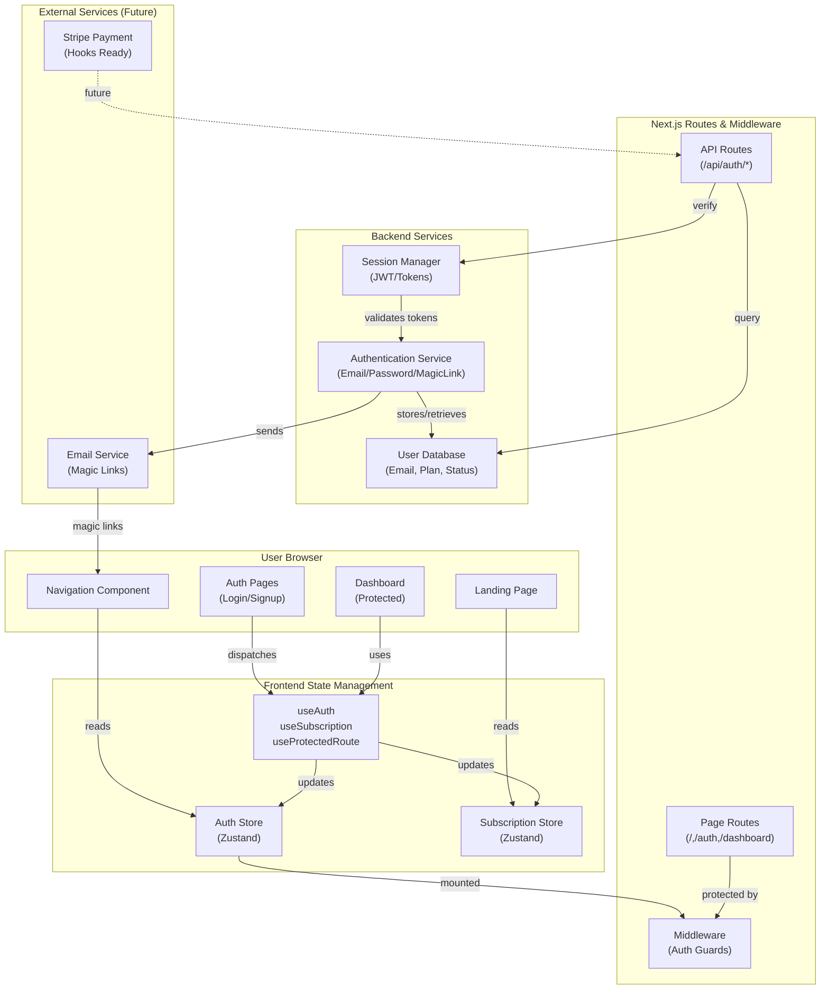

---

## Component Hierarchy

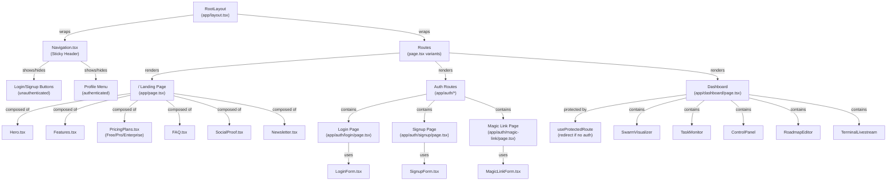

---

## Data Flow - Signup Journey

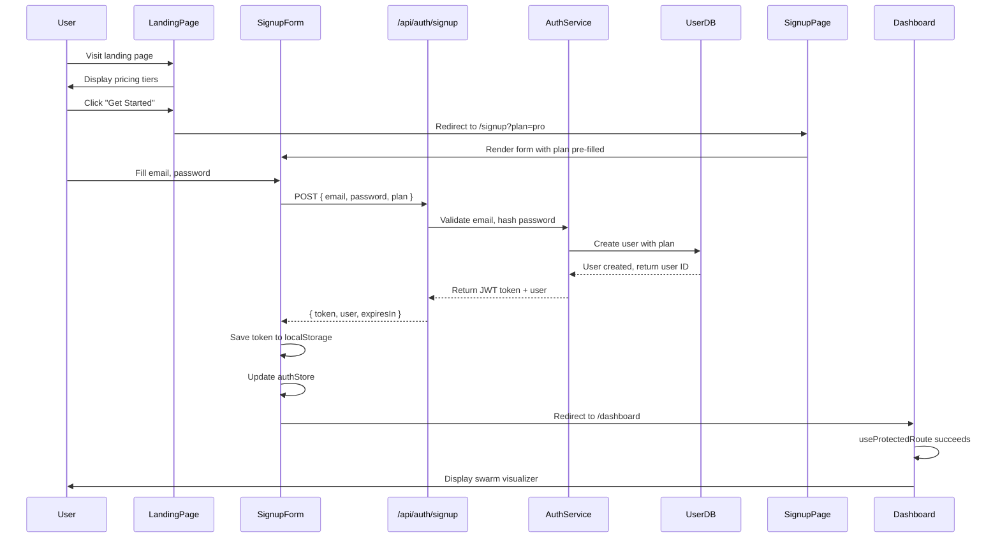

---

## Data Flow - Login Journey

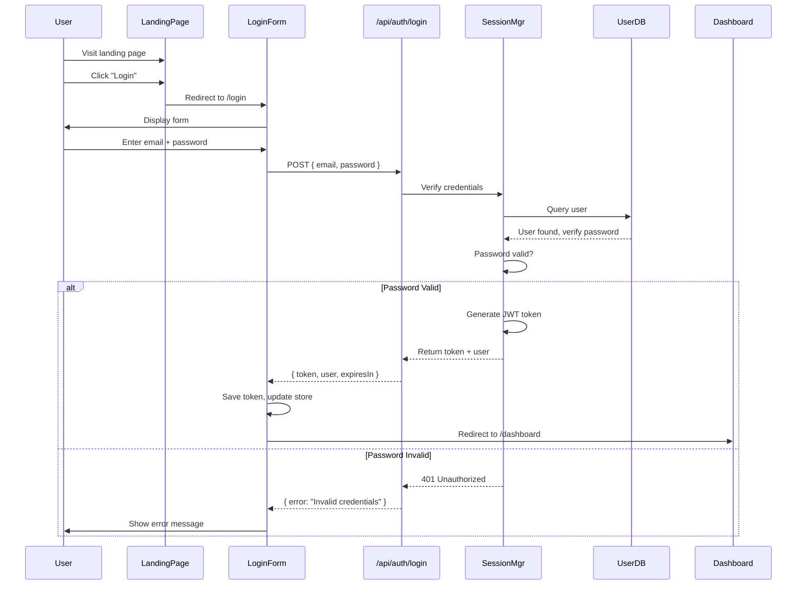

---

## Data Flow - Dashboard Access

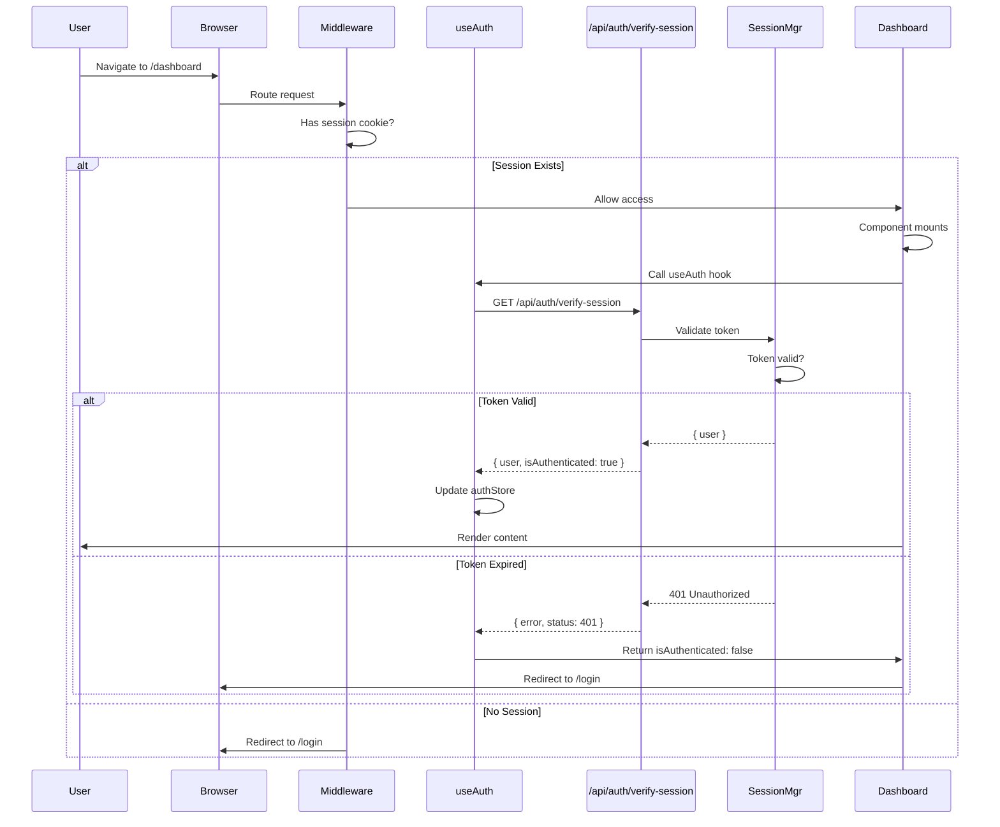

---

## Authentication State Machine

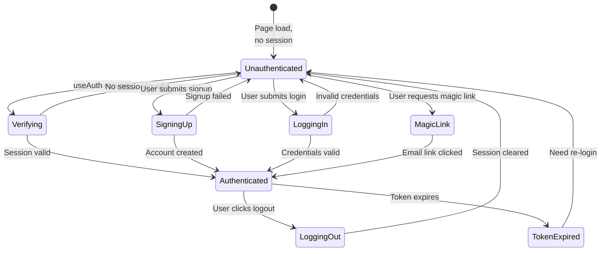

---

## Pricing Tier Data Model

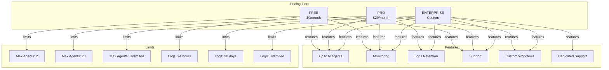

---

## File Structure - New Files

```
packages/web/
├── app/
│   ├── layout.tsx (MODIFIED - add Navigation wrapper)
│   ├── page.tsx (REPLACED - landing page)
│   │
│   ├── (auth)/ (NEW - auth routes group)
│   │   ├── login/
│   │   │   └── page.tsx
│   │   ├── signup/
│   │   │   └── page.tsx
│   │   └── magic-link/
│   │       └── page.tsx
│   │
│   ├── dashboard/ (NEW - protected route)
│   │   └── page.tsx (OLD: app/page.tsx content)
│   │
│   └── api/
│       └── auth/ (NEW)
│           ├── login/route.ts
│           ├── signup/route.ts
│           ├── logout/route.ts
│           ├── verify-session/route.ts
│           └── magic-link/route.ts
│
├── components/
│   ├── Navigation.tsx (NEW)
│   ├── Navigation/
│   │   ├── NavLinks.tsx (NEW)
│   │   ├── AuthMenu.tsx (NEW)
│   │   └── MobileMenu.tsx (NEW)
│   │
│   ├── LandingPage/ (NEW)
│   │   ├── Hero.tsx
│   │   ├── Features.tsx
│   │   ├── PricingPlans.tsx
│   │   ├── FAQ.tsx
│   │   ├── SocialProof.tsx
│   │   └── Newsletter.tsx
│   │
│   ├── auth/ (NEW)
│   │   ├── LoginForm.tsx
│   │   ├── SignupForm.tsx
│   │   └── MagicLinkForm.tsx
│   │
│   ├── common/ (NEW)
│   │   ├── Button.tsx
│   │   ├── Card.tsx
│   │   ├── Input.tsx
│   │   └── Spinner.tsx
│   │
│   └── Dashboard/ (NEW - optional wrapper)
│       └── DashboardLayout.tsx
│
├── hooks/
│   ├── useAuth.ts (NEW)
│   ├── useSession.ts (NEW)
│   ├── useProtectedRoute.ts (NEW)
│   └── useSubscription.ts (NEW)
│
├── lib/
│   ├── auth.ts (NEW)
│   ├── api-client.ts (NEW)
│   └── constants.ts (NEW - pricing tiers, features)
│
├── store/
│   ├── authStore.ts (NEW)
│   └── subscriptionStore.ts (NEW)
│
├── types/
│   ├── auth.ts (NEW)
│   ├── subscription.ts (NEW)
│   └── api.ts (NEW)
│
├── middleware.ts (MODIFIED - add auth checks)
└── globals.css (MODIFIED - ensure consistency)
```

---

## Authentication Token Flow

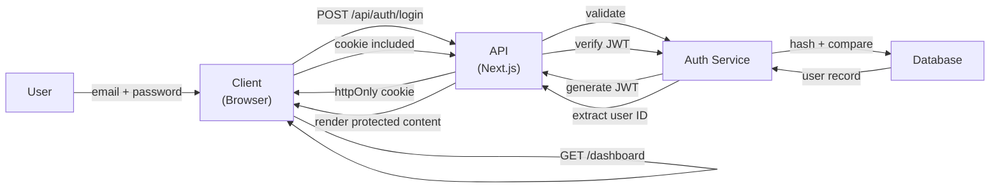

---

## Session Lifecycle

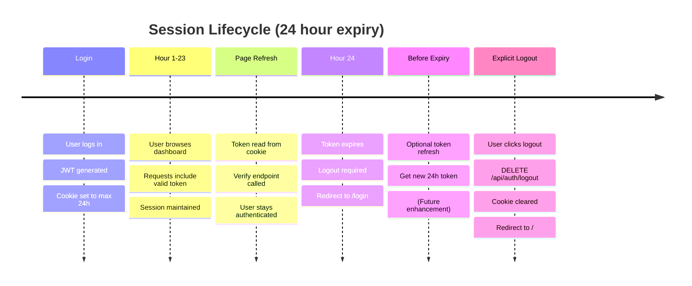

---

## Responsive Design Breakpoints

```
Mobile (xs): 320px - 640px
  - Single column layout
  - Hamburger menu for navigation
  - Large touch targets (44px min)
  - Stack all cards vertically

Tablet (md): 768px - 1024px
  - Two column layout
  - Simplified navigation
  - Larger text

Desktop (lg): 1024px+
  - Three column layout
  - Full navigation visible
  - Optimal spacing

Tailwind Classes:
  sm: 640px   (not used in this design)
  md: 768px   (tablets)
  lg: 1024px  (desktop)
  xl: 1280px  (large desktop)
```

---

## Performance Optimization Strategy

```mermaid
graph TD
    Code["Code Splitting"]
    Images["Image Optimization"]
    Cache["Caching Strategy"]
    Fonts["Font Loading"]
    API["API Optimization"]
    
    Code -->|Next.js dynamic imports| DynImport["Lazy load components"]
    Code -->|Route-based splitting| RouteCode["Each route minimal JS"]
    
    Images -->|next/image| ResponsiveImg["Responsive images"]
    Images -->|WebP format| WebP["Modern formats"]
    Images -->|Lazy loading| LazyImg["Load on scroll"]
    
    Cache -->|Static generation| Static["Pre-build landing page"]
    Cache -->|Browser cache| BrowserCache["Long-lived assets"]
    Cache -->|CDN cache| CDNCache["Serve from edge"]
    
    Fonts -->|System fonts| SysFonts["Avoid external fonts"]
    Fonts -->|Font subsetting| Subset["Load only used chars"]
    
    API -->|Query optimization| Query["Minimal queries"]
    API -->|Caching| APICach["Cache auth verify"]
    API -->|Compression| Compress["gzip responses"]
```

---

## Security Architecture

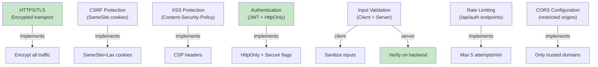

---

## Error Handling Flow

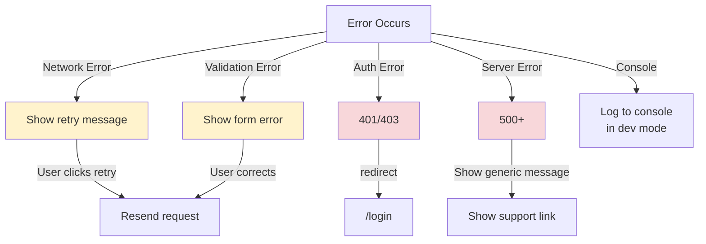

---

## Future Enhancements (Post-Launch)

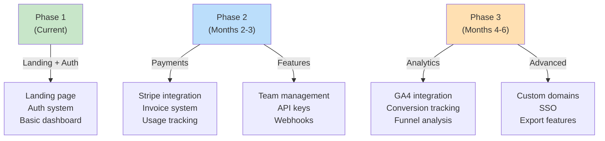

---

## Key Metrics to Track

```
Performance Metrics:
├── Lighthouse Score (target: ≥80)
├── Core Web Vitals
│   ├── LCP (Largest Contentful Paint): <2.5s
│   ├── FID (First Input Delay): <100ms
│   └── CLS (Cumulative Layout Shift): <0.1
├── Bundle Size: <200KB (gzipped)
└── Time to Interactive: <3s

Business Metrics:
├── Signup Conversion Rate (target: >5%)
├── Login Success Rate (target: >98%)
├── Plan Selection Distribution
│   ├── Free: 60%
│   ├── Pro: 35%
│   └── Enterprise: 5%
├── Session Duration
└── Churn Rate

User Experience Metrics:
├── Form Abandonment Rate (target: <20%)
├── Error Rate (target: <0.1%)
├── Mobile vs Desktop split
└── Browser compatibility
```

---

## Team Coordination

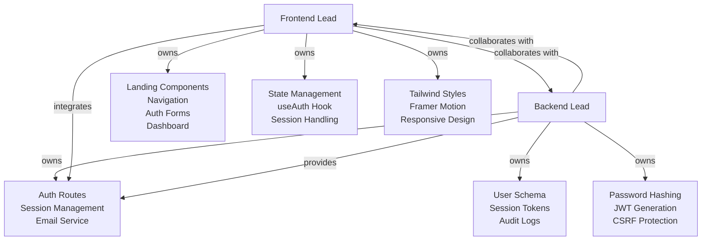

---

## Summary

This architecture provides:

1. **Clear Separation of Concerns** - Frontend, state, API, backend clearly separated
2. **Secure Authentication** - JWT tokens, HttpOnly cookies, CSRF protection
3. **Responsive Design** - Mobile-first approach with breakpoints
4. **Performance Optimized** - Code splitting, image optimization, caching
5. **Scalable Structure** - Easy to add features and extend
6. **Error Handling** - Graceful failures with user feedback
7. **Future-Ready** - Hooks and stubs for Stripe, analytics, advanced features

